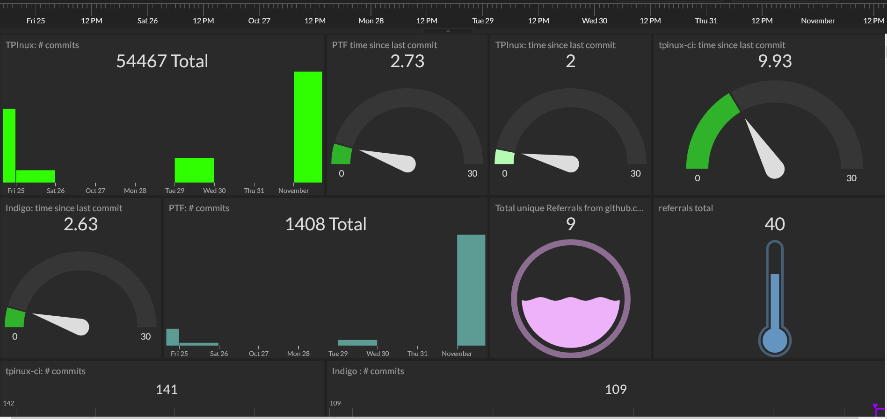
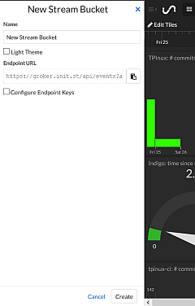
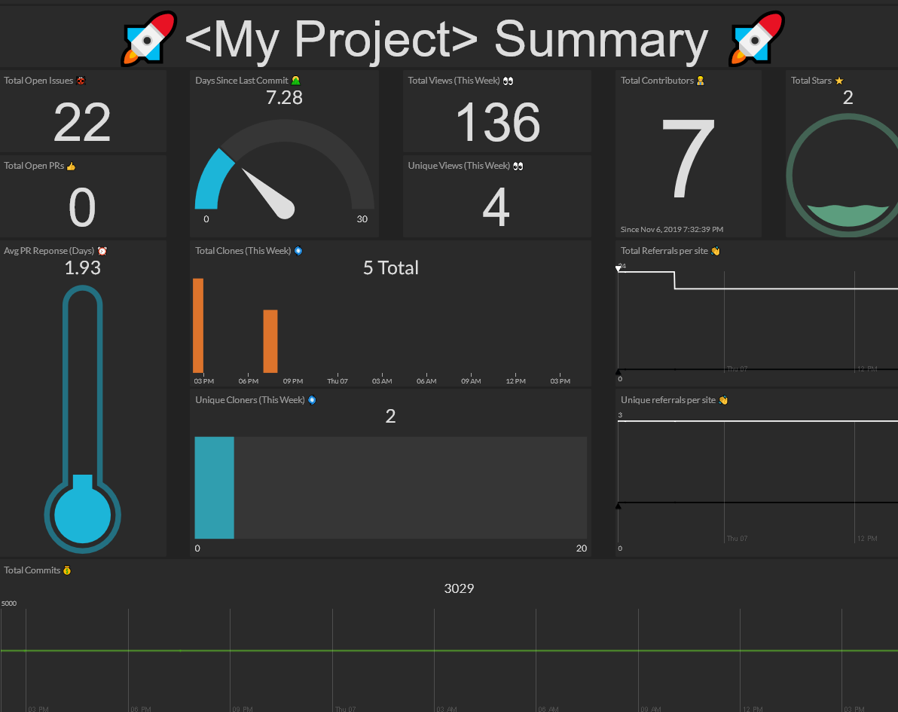

# Maintainer stats collector 
[](https://github.com/tektronix)
[](https://www.codefactor.io/repository/github/tektronix/initialstate-kpi-streamer)

 Python Utility for collecting repo statistics from GitHub and streaming results to an [Initial State Dashboard](https://www.initialstate.com/)  
 
 Example: https://go.init.st/0sjumwe  

 NOTE: Currently, both API v3 and API v4 are in use for this project. Ideally, API v4 would be exclusively used, but until the schema is complete, some metrics are unavailable and instead use PyGithub for API v3 access.

## Table of Contents
 + [About](#about)
 + [Installation](#installation)
 + [Initial State Setup](#initialstate)
 + [Example Finished Dashboard](#example)
 + [Program Usage](#usage)
 + [Maintainer](#maintainer)
 + [Supporting Links](#links)

## About <a name="about"></a>
Current Metrics this query engine supports:
#### **Discovery**  
Are people able to find my project(s)?  
* Rationale: We are interested in understanding the impact of activities on user engagement (blog posts, conference meetups, etc.) e.g. Was my Medium article successful in directing new potential users to my project?  
  <details><summary><b>Total Page Views</b></summary>
  
  APIv3: `GET /repos/:owner/:repo/traffic/views`  
  Returns two values, representing total and unique page views (per week); duration can be specified in `maintainer_v3.py`  
  
  Example return:
  ```
  get_views_count():
  {'count': 213,
   'uniques': 10,
   'views': [View(uniques=3, timestamp=2019-10-21 00:00:00, count=57),
             View(uniques=6, timestamp=2019-10-28 00:00:00, count=131),
             View(uniques=8, timestamp=2019-11-04 00:00:00, count=25)]
  }
  ```
  
  </details>
  <details><summary><b>Total unique visitors</b></summary>
  
  APIv3: `GET /repos/:owner/:repo/traffic/views`  
  Returns two values, representing total and unique page views (per week); duration can be specified in `maintainer_v3.py`  
  
  Example return:
  ```
  get_views_count():
  {'count': 213,
   'uniques': 10,
   'views': [View(uniques=3, timestamp=2019-10-21 00:00:00, count=57),
             View(uniques=6, timestamp=2019-10-28 00:00:00, count=131),
             View(uniques=8, timestamp=2019-11-04 00:00:00, count=25)]
  }  
  ```
  
  </details>
  <details><summary><b>Referring Sites</b></summary>
 
   APIv3: `GET /repos/:owner/:repo/traffic/popular/referrer`
   Returns two separate dictionaries, `{site:totalcount}` & `{site:uniquecount}`, for referring sites (key) and total/unique visitors (values)
  
  Example return:
  ```
   get_referrer_count():
   [Referrer(uniques=7, referrer="github.com", count=52),
   Referrer(uniques=2, referrer="login.microsoftonline.com", count=4),
   Referrer(uniques=1, referrer="cla-assistant.io", count=1)]
  ```
  
  </details>
  <details><summary><b>GitHub Stars</b></summary>

  APIv3: `GET /repos/:owner/:repo/stargazers`
  Returns single value representing current total number of stars on project.
  
  Example return:
  ```
  Total # of stars for <project>: 42
  ```
  </details>

#### Usage
Who is getting use from the project(s)?

* Rationale: We are interested in understanding how widely used our projects are with the goal being to produce more impactful software projects that can be recommended for reuse. Clone and Fork counts presume that the project is being utilized and actively developed on, this can also serve as a proxy measurement for popularity (not without biases)  
  <details><summary><b>Number of Clones</b></summary>
	
	APIv3: `GET /repos/:owner/:repo/traffic/clones`  
	Returns two values, representing total and unique clones (per week); duration can be specified in `maintainer_v3.py`  
	NOTE: per week does actually mean the 'Last 14 days'  
	  
	Example return:  
	```
	get_clone_count():
	   {'clones': [Clones(uniques=2, timestamp=2019-10-21 00:00:00, count=2),
            Clones(uniques=4, timestamp=2019-10-28 00:00:00, count=4),
            Clones(uniques=1, timestamp=2019-11-04 00:00:00, count=1)],
 	'count': 7,
 	'uniques': 6}
	```
	
  </details>
  <details><summary><b>Number of Unique Cloners</b></summary>
	
	APIv3: `GET /repos/:owner/:repo/traffic/clones`  
	Returns two values, representing total and unique clones (per week); duration can be specified in `maintainer_v3.py`  
	NOTE: per week does actually mean the 'Last 14 days'  
	  	
	Example return:  
	```
	get_clone_count():
	   {'clones': [Clones(uniques=2, timestamp=2019-10-21 00:00:00, count=2),
            Clones(uniques=4, timestamp=2019-10-28 00:00:00, count=4),
            Clones(uniques=1, timestamp=2019-11-04 00:00:00, count=1)],
 	'count': 7,
 	'uniques': 6}
	```
	
  </details>
  <details><summary><b>Number of forks</b></summary>
	
	APIv3:  `GET /repos/:owner/:repo/forks_count`  
	Returns single value representing total number of active forks  
	
	Example Return:
	```
	get_fork_count():
	4
	```
  </details>

#### Retention:
How active is the project(s)?

* Rationale:  These metrics serve as an indicator for understanding how active a community is around supporting a project, with a goal to foster and grow self-sustaining communities around code. 
  <details><summary><b>Total contributor count </b></summary>
	
	APIv3: `GET /repos/:owner/:repo/contributor`  
	Returns single value representing total number of contributors (with GitHub accounts)  
	
	Example Return:
	```
	get_contributor_count():
	11
	```
	
  </details>
  <details><summary><b># of total commits</b></summary>
	
	APIv4: Query for `Commit` and `CommitHistoryConnection` Fields  
	Returns the total count of items in the connection., representing total commits added to defaultBranchRef  
	
	Example Return:  
	```
        {'data': 
          {'repository':
            {'defaultBranchRef': 
              {'target': 
                {'history': 
                  {'edges': 
                    [{'node': {'commitUrl': 'https://github.com/tektronix/curvequery/commit/7b072ba5877ba6fb37a516eaa4b15fc1a8cf369b', 'committedDate': '2019-10-25T17:55:16Z' }}],
                   'totalCount': 19
                 }
               }
             }
           }
         }
       }
	```    

  </details>
  <details><summary><b>Days since last commit </b></summary>
	
	APIv4:  Query for `Commit` and `CommitHistoryConnection` Fields  
	Returns timestamp for the datetime when top commit was committed.  
	
	Example Return:  
	```
        {'data': 
          {'repository':
            {'defaultBranchRef': 
              {'target': 
                {'history': 
                  {'edges': 
                    [{'node': {'commitUrl': 'https://github.com/tektronix/curvequery/commit/7b072ba5877ba6fb37a516eaa4b15fc1a8cf369b', 'committedDate': '2019-10-25T17:55:16Z' }}],
                   'totalCount': 19
                 }
               }
             }
           }
         }
       }
	```    
	
 </details>  
    

#### Project Health:
How well is/are the project(s) being maintained?

* Rationale: We are interested in understanding the challenges of maintaining projects with the goal being to promote efficiency, inclusiveness, and high quality.  
  <details><summary><b># of Open Issues</b></summary>
	
   APIv4: Query the `IssueConnection` Fields for a Repository  
   (https://developer.github.com/v4/object/issueconnection/)  
   Returns the total count of items in the issue connection with `state:OPEN`  
   Example Return:
   ```
   get_project_health_metrics():
   {'data': 
     {'repository': 
       {'issues': 
         {'totalCount': 10}
        }
      }
    }
    ```
	
  </details>
  <details><summary><b># of Open Pull Requests</b></summary>
   
   APIv4: Query the `PullRequestConnection` Fields for a Repository  
   (https://developer.github.com/v4/object/pullrequestconnection/)  
   Returns the total count of items in the issue connection with `state:OPEN`  
   Example Return:
   ```
   get_project_health_metrics():
   {'data': 
     {'repository': 
       {'pullRequests': 
         {'totalCount': 1}
        }
      }
    }
    ```
    
  </details>
  <details><summary><b>Average PR Response time</b></summary>
	
  APIv4: Query the last **5** `PullRequestTimeLineConnection!`'s and Node Fields for Events `createdAt`  
  Returns a mean average of all Pullrequest nodes and their respective datetime differences between Start and Stop events.  
    e.g. `{REVIEW_REQUESTED_EVENT, READY_FOR_REVIEW_EVENT, REOPENED_EVENT}` (whichever is found last) and `{MERGED_EVENT, REVIEW_DISMISSED_EVENT}`  
  More information on PullRequest event strings: https://developer.github.com/v4/enum/pullrequesttimelineitemsitemtype
  
  Example Return: 
  ```
  {'data': 
    {'repository': 
      {'pullRequests': 
      {'nodes': [{'timelineItems': 
      {'nodes': [{'__typename': 'ReviewRequestedEvent','createdAt': '2019-10-15T20:09:46Z', 'requestedReviewer': {'login': 'nlynchjo'}},
      {'__typename': 'MergedEvent', 'createdAt': '2019-10-25T16:23:42Z'}]},
  
      'title': 'Create example documentation'},
      {'timelineItems': 
      {'nodes': [{'__typename': 'ReviewRequestedEvent', 'createdAt': '2019-10-15T21:05:17Z', 'requestedReviewer': {'login': 'nlynchjo'}},
      {'__typename': 'MergedEvent', 'createdAt': '2019-10-25T16:23:25Z'}]},

  ...
  .. <RINSE AND REPEAT FOR ALL PULL REQUESTS QUERIED>
  .
 
      'title': 'Add exception handling for empty pull requests data'}],
      'pageInfo': {'hasPreviousPage': True, 'startCursor': 'Y3Vyc29yOnYyOpHOE5OnyQ=='},
      'totalCount': 7}
      }
    }
  }
										  
  ```
  </details>

#### Organizational Velocity:  
What is the development speed for an organization?
* Rationale: We are interested in understanding the focus areas of our communities with the goal of being able to estimate the most recent labor investments spent on our software projects. 
  <details><summary><b># of issues closed recently</b></summary> 
	
	TODO
	
  </details>
  <details><summary><b># of reviews added</b></summary>	
	
	TODO
	
  </details>
  <details><summary><b># of code changes</b></summary>
	
	TODO
	
  </details>
  <details><summary><b># of unique committers</b></summary>
	
	TODO
	
  </details>

## Installation<a name="installation"></a>
#### Requirements: 
Python3+  

* Virtual environment setup:  
  `$ python3 -m venv .env`  

* Activate environment before installing dependencies:  
  `$ source .env/bin/activate`  
  NOTE: on Python3.8+ look for the activate scripts in `.env/Scripts/activate`

* Update pip/setuptools and install wheel  
  `$(.env) python -m pip install --upgrade pip setuptools wheel`

* Install project dependencies:  
   `$(.env) pip install -r requirements.txt`  

* Run the project for any tektronix repo:   
  `$(.env) python maintainer_stats.py --token <GITHUB_TOKEN> --repo <repo_name (e.g. numconverter)>`  

#### GitHub Token Access
To enable proper access for all of the queries, generate a new API token with the following scope:
```
   user
   public_repo
   repo
   repo_deployment
   repo:status
   read:repo_hook
   read:org
   read:public_key
   read:gpg_key
```

## Initial State Setup<a name="initialstate"></a>


The results of each query can be streamed as unique signals to be displayed in the Initial State tiles app! 

Sign up for an account on their webpage and create a new Stream Bucket...

  
Once created,  your new dashboard will need some data!

You'll need to manually extract a few things from your Dashboard Settings Page...

Click Settings and Give your Dashboard a Name, you'll need this name later: 

* Bucket Key, e.g. 'ABCDEFG1282N'
* Access Key, e.g. 'ist_ArgadfsjkWWjdgdfsnf322k4nsdnfdsfds'
* Bucket Name, e.g. 'My Awesome Dashboard :rocket:'

These items can be fed to the maintainer_stats utility as command line arguments, OR you can export them into your environment variables: 

```
$(.env) export ISS_BUCKET_NAME='My Awesome Dashboard :rocket:'
$(.env) export ISS_BUCKET_KEY=`ABCDEFG1282N`
$(.env) export ISS_ACCESS_KEY='ist_ArgadfsjkWWjdgdfsnf322k4nsdnfdsfds'
```

Run the utility against your project, or list of projects to get some initial tiles to work with

```
$(.env) maintainer_stats/python maintainer_stats.py -r programmatic-control-examples

Retrieving results for... tektronix\programmatic-control-examples       [DONE]
Streaming results for...  tektronix\programmatic-control-examples to Initial State Bucket (GHExport)    (╯°□°)╯ ︵┻━┻!! [DONE]
```

And Behold, you can now begin formatting your dashboard to your hearts content using the 'Edit Tiles' button. 

Check out the Initial State documentation for more information on all the cool things you can do. 
* [Initial State: Customize Your Tiles Dashboard](https://support.initialstate.com/hc/en-us/articles/360003879391-2-Customize-Your-Tiles-Dashboard)

## Example Finished Dashboard using the data collected from these stats on a real project: <a name="example"></a>



## Usage<a name="usage"></a>
```
usage: maintainer_stats.py [-h] [-o  GH_ORG] [-u  GH_USER] [-b BRANCH_NAME]
                           [-r  REPO_NAME [REPO_NAME ...]] [-t  GH_TOKEN]
                           [-n --ISSBName  ISS_NAME]
                           [-k --ISSBKey  ISS_BUCKET_KEY]
                           [-i --ISSKey  ISS_KEY] [-d]

Maintainer stats utility
required arguments:
  -o, --org  
         GitHub Enterprise org URL 
         (default: tektronix)

  -r, --repo  REPO_NAME [REPO_NAME ...]
         specific repo or list of repos (e.g. tpinux tpinux-ci ...)
         (default: <none>)

   -t, --token GITHUB_TOKEN
         GitHub API token (or env var GITHUB_TOKEN) 
         (default: environment variable)

optional arguments:
  -h, --help            show this help message and exit

  -u  GH_USER, --user  GH_USER
                        GitHub user    
                        (default: <none>)

  -b --branch  BRANCH_NAME
                        Target branch ref for Retention Metrics
                        NOTE: If branch is specifed, and multiple repos
                        are targetted, make sure the branch name exists 
                        on all remotes. If this argument is omitted, 
                        defaultRefBranch is used for all repos
                        (default: <none>)

  -n --ISSBName  ISS_NAME
                        Initial State Stream Bucket Name 
                        (or env var ISS_BUCKET_NAME) 
                        (default: <none>)

  -k --ISSBKey  ISS_BUCKET_KEY
                        Initial State Stream Bucket Key 
                        (or env var ISS_BUCKET_KEY) 
                        (default: <none>)
                        
  -i --ISSKey  ISS_KEY  Initial State Stream Access Key 
                        (or env var ISS_ACCESS_KEY) (default: <none>)

  -d , --debug          enable debug logging 
                        (default: false)
```
## Maintainer
[Nick Lynch-Jonely](https://github.com/nlynchjo)  

## Supporting Links<a name="links"></a>
[GitHub's GraphQL API v4 developer page](https://developer.github.com/v4/)  
[GitHub's REST API v3 developer page](https://developer.github.com/v3/)  
[PyGithub Documentation site](https://pygithub.readthedocs.io/en/latest/introduction.html)  
[Initial State](https://support.initialstate.com/hc/en-us)  

